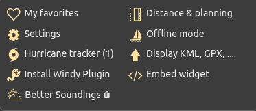
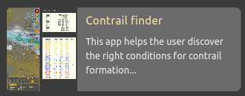
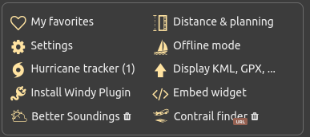
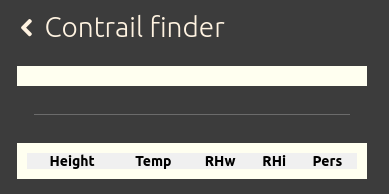
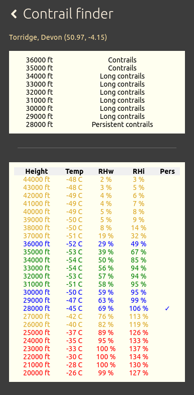

# Windy Plugin

Plugin to calculate the appearance of contrails.

## Please note: 

1. Due to Windy security restrictions, the plugin is only available on the desktop versions of Windy.

2. The analysis relies on the accuracy of the Windy data, which is further modelled by the plugin to find flight levels. Some inaccuracies may be present. 

## Installation:

Click on the Windy menu  
  

Choose Install Windy plugin  
  

Locate the contrail plugin and click  
  

The icon opens up, click (Install plugin)  
  

* To install an update, delete the existing plugin from Windy and load the latest version.

## Basic usage 

Click on the Windy menu and choose Contrail finder  
  

When ready, A blank analysis is seen  
  

Click anywhere on the map, and the tables will fill with an analysis for the area that is clicked.  
  

### New feature v1.1.0
Context menu option is now available - Right click on the Windy map, and you should see "Contrail finder" on the menu.  
 
### Further information
We are updating the GitHub wiki to provide a detailed explanation of how the plugin operates and what the figures represent. The plugin includes a link for easy access.

## Notes

The plugin analyses the atmospheric conditions (pressure, temperature, humdity) at the location of the click. For accuracy, follow an aircraft on a tracker and click the Windy map at the current aircrafts position. 

# CHANGELOG

-   1.1.0
    -   Context menu entry
    -   Choose the forecast closest to the current time
    -   Two analysis tables
    -   Refactored contrail code out of plugin.svelte
-   1.0.2
    -   Fixed author
-   1.0.1
    -   Added screenshot 
-   1.0.0
    -   Official plugin 
-   0.1.5
    -   Prediction table
    -   Add location title
    -   Use selected weather model  
    -   Installation
-   0.1.4
    -   Declutter table & colour coded
-   0.1.3
    -   Rest of calculations stratified
-   0.1.2
    -   Version to get full range of soundings
-   0.1.1
    -   Version to get data at 300hPa
-   0.1.0
    -   Initial version of this repo
