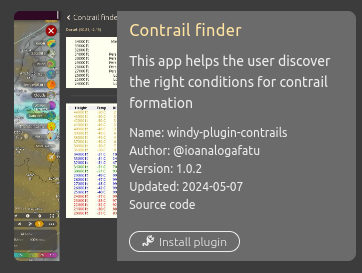

# Windy Plugin

Plugin to calculate the appearance of contrails.

## Please note: 
1. This plugin is under development. Windy will regard it as an untrusted plugin. The code however is available to view at github.
https://github.com/IoanaLogafatu/windy-plugin-contrails

2. Due to Windy security restrictions, the app is only available on the desktop versions of Windy.

3. The analysis relies on the accuracy of the Windy data, which is further modelled by the app to find flight levels. Some inaccuracies may be present. 

## Installation:

Click on the Windy menu  
  

Choose Install Windy plugin  
  

Choose Load plugin directly from URL  
  

The final bit.  
  

Enter the URL
https://windy-plugins.com/8724298/windy-plugin-contrails/0.1.5/plugin.min.js  
and click Install Untrusted Plugin

The version number will change for every release. While this is an untrusted plugin, your version will not auto update. Please check back occasional for updates.

* To install an update, delet the existing plugin from Windy and load the latest version.

## Usage 

Click on the Windy menu and choose Contrail finder  
  

When ready, A blank analysis is seen  
  

Click anywhere on the map, and the tables will fill with an analysis for the area that is clicked.  
  

## Notes

The plugin analyses the atmospheric conditions (pressure, temperature, humdity) at the location of the click. For accuracy, follow an aircraft on a tracker and click the Windy map at the current aircrafts position. 

# CHANGELOG

-   1.0.2
    -   Fixed author
-   1.0.1
    -   Added screenshot 
-   1.0.0
    -   Official plugin 
-   0.1.5
    -   Prediction table
    -   Add location title
    -   Use selected weather model  
    -   Installation
-   0.1.4
    -   Declutter table & colour coded
-   0.1.3
    -   Rest of calculations stratified
-   0.1.2
    -   Version to get full range of soundings
-   0.1.1
    -   Version to get data at 300hPa
-   0.1.0
    -   Initial version of this repo
